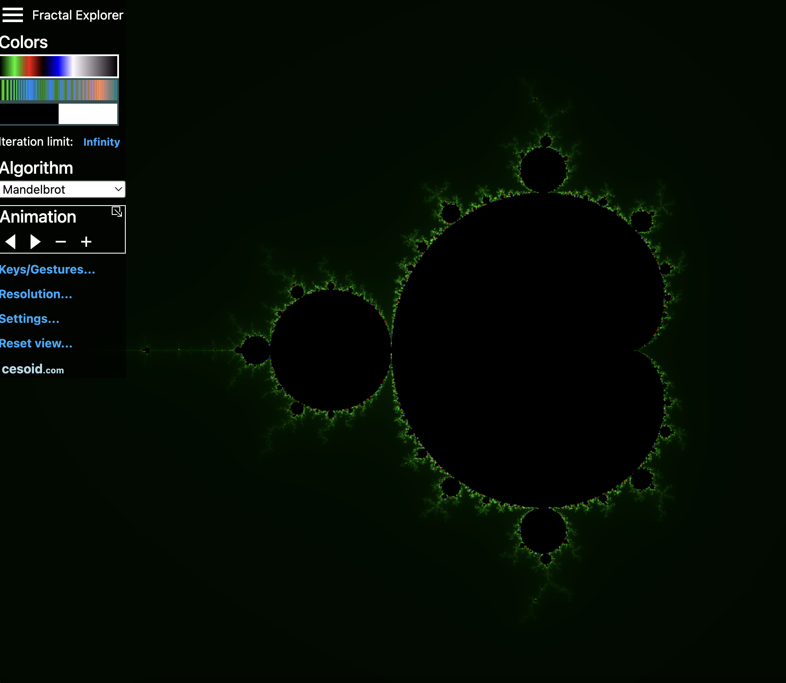
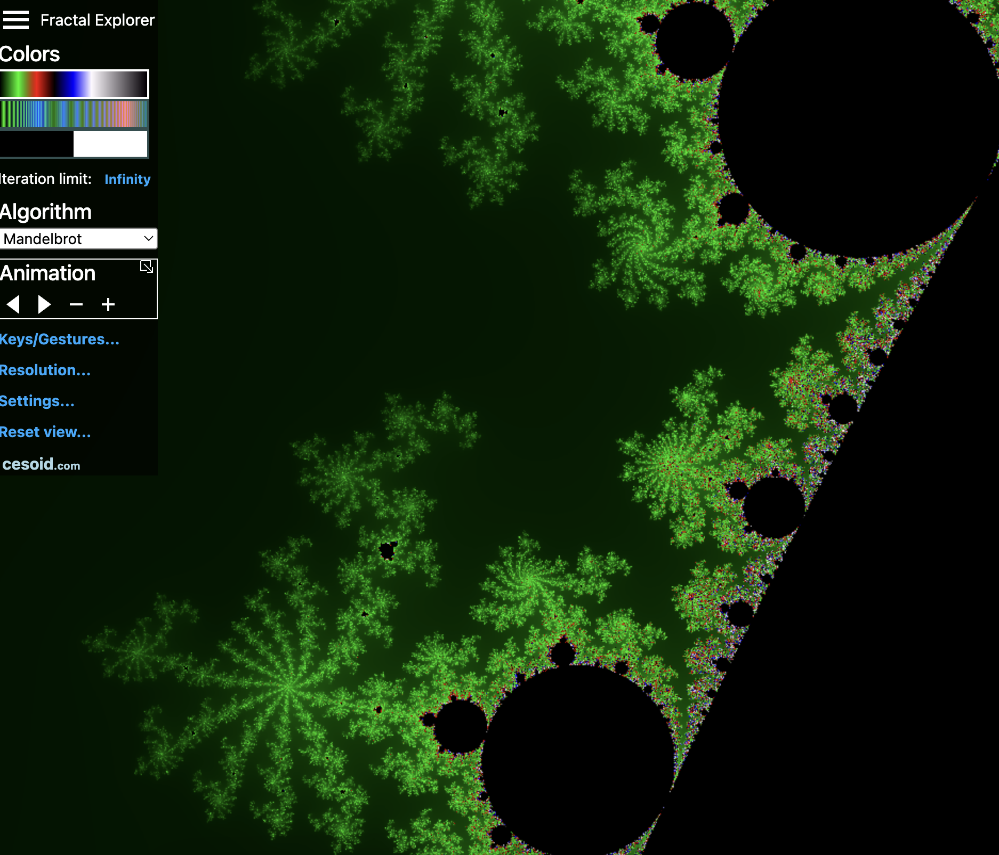
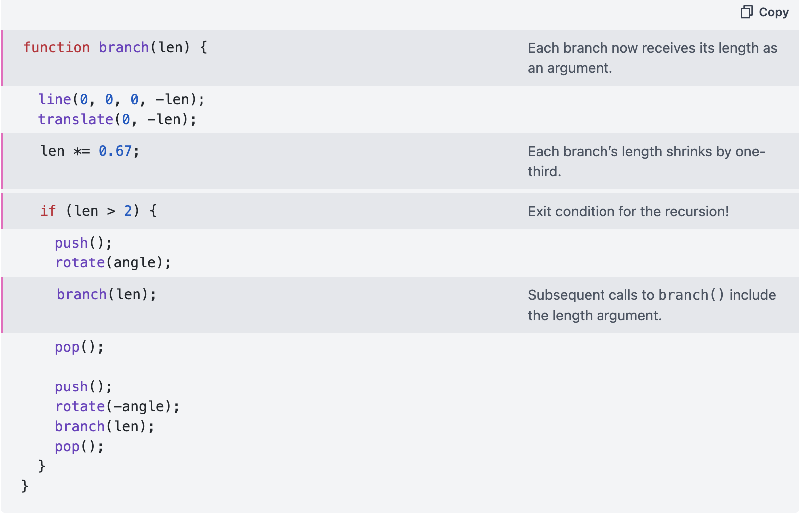
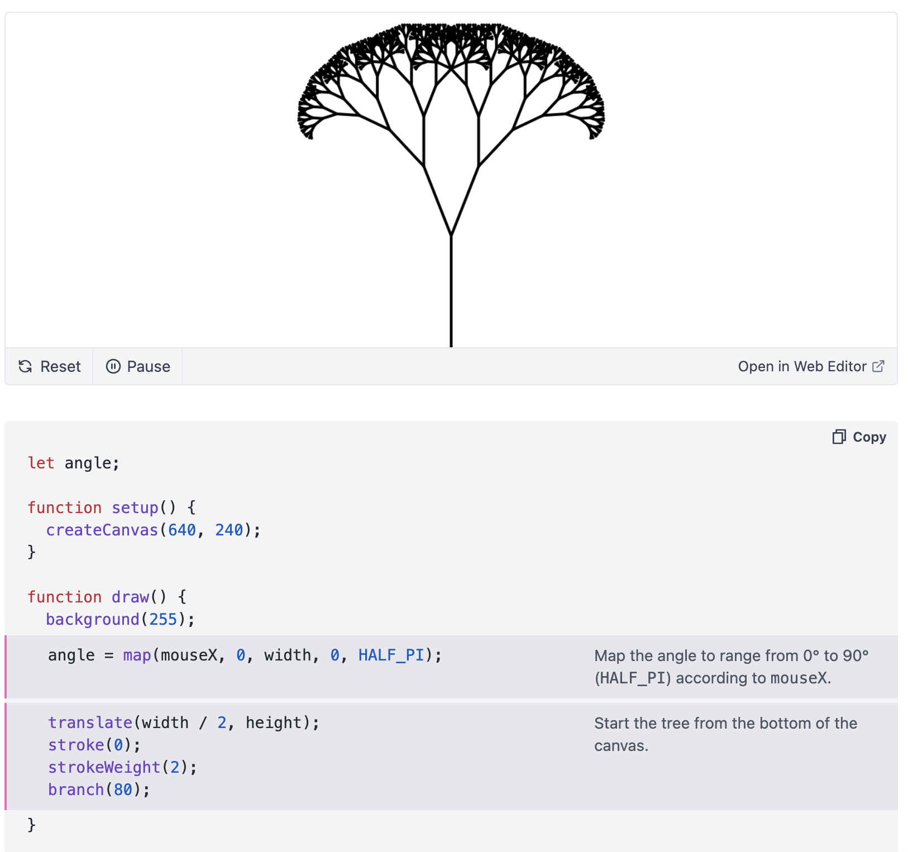

# Week 8 quiz
### **Part 1: Imaging Technique Inspiration**

An example of an imaging technique that I find inspirational towards the assignment is [this](https://www.cesoid.com/fractal) Fractal Explorer website by Cesoid. In particular, I am drawn to the infinite zooming effect, which creates a sense of depth and motion that feels both abstract and immersive. I would like to recreate this effect, as I can imagine ways of incorporating it into the project regardless of which animation method my group members decide on.

  
  

### **Part 2: Coding Technique**
When I first explored fractal artworks in p5.js, I read [chapter 8](https://natureofcode.com/fractals/) of *The Nature of Code* by Daniel Shiffman. I later realised I had overlooked that fractals would be covered in week 10 of the canvas. Still, the chapter provided valuable insight into creating dynamic, natural fractals, especially the Koch curve and L-systems. It also emphasized the importance of avoiding infinite recursion and simplifying computation by calculating points relative to angles rather than distance. The images below demonstrate a simple scalable tree created with vectors, where the rotation angle is controlled by the mouseX position.

  
  

